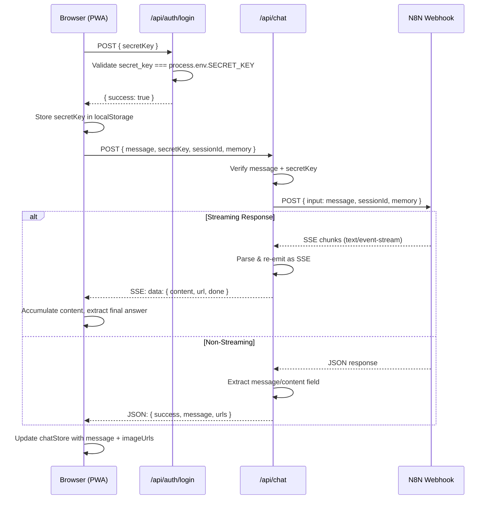
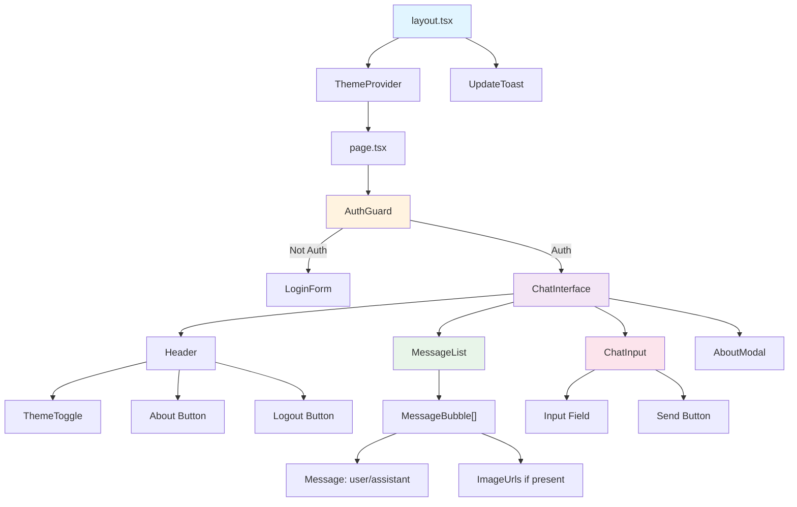
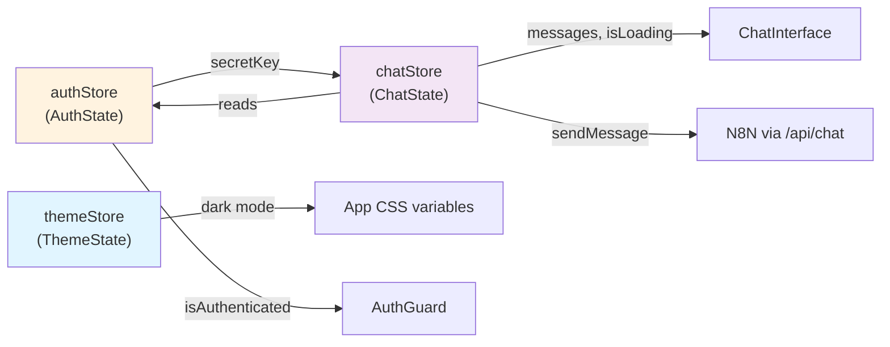
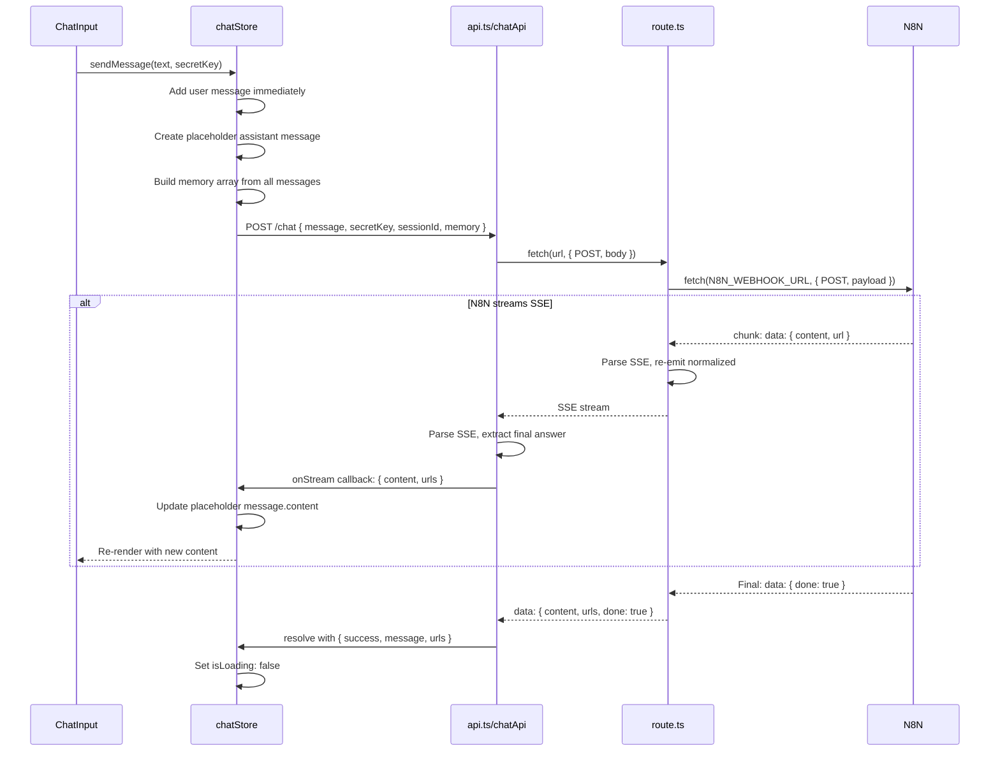

# Architecture & Component Graph

## Request Flow Diagram



## Component Tree



## Store Relationships



## State Management Details

### authStore
```ts
interface AuthState {
  isAuthenticated: boolean    // logged in?
  secretKey: string | null    // stored in localStorage
  isLoading: boolean          // checking auth on mount
  error: string | null        // login error
}

interface AuthStore extends AuthState {
  login: (creds: LoginCredentials) => Promise<boolean>
  logout: () => void
  checkAuth: () => Promise<void>  // validates stored key on app load
  clearError: () => void
}
```

**Flow:**
1. `layout.tsx` calls `useAuthStore().checkAuth()` on mount
2. `checkAuth()` reads `SECRET_KEY` from localStorage
3. If exists, POSTs to `/api/auth/validate` to confirm it's valid
4. Sets `isAuthenticated` + `secretKey` or clears both on failure
5. `AuthGuard` reads `isAuthenticated` → shows LoginForm or ChatInterface

**localStorage Keys:**
- `secret-key`: The authentication token
- `session-id`: N8N session ID for conversation memory

### chatStore
```ts
interface ChatState {
  messages: Message[]    // all messages (user + assistant)
  isLoading: boolean     // waiting for response
  error: string | null   // API errors
}

interface ChatStore extends ChatState {
  sendMessage: (message: string, secretKey: string) => Promise<void>
  addMessage: (msg: Omit<Message, 'id' | 'timestamp'>) => void
  updateLastMessage: (content: string) => void
  clearMessages: () => void
  clearError: () => void
}
```

**Flow:**
1. User types in `ChatInput`, presses enter → calls `useChatStore().sendMessage(text, secretKey)`
2. `sendMessage()`:
   - Adds user message to state immediately
   - Creates placeholder assistant message (empty)
   - POSTs to `/api/chat` with `{ message, secretKey, sessionId, memory }`
   - Subscribes to SSE stream via `chatApi.sendMessage(req, onStream)`
   - `onStream` callback updates placeholder message as chunks arrive
   - When `done: true`, finalizes message
   - On error, removes placeholder message + shows error
3. `ChatInterface` watches `messages` array → re-renders

**Memory Management:**
- Built from `messages` array before each request
- Includes all previous user + assistant messages
- Excludes current (incomplete) assistant message
- Sent as `memory: [{ role, content }, ...]` to N8N

### themeStore
```ts
interface ThemeState {
  isDark: boolean     // dark mode active?
  toggleTheme: () => void
  setTheme: (isDark: boolean) => void
}
```

**Flow:**
1. `ThemeProvider` reads `isDark` from `themeStore`
2. Applies `dark` class to `<html>`
3. CSS in `globals.css` applies `.dark` CSS variable overrides
4. Tailwind respects `darkMode: "class"` → uses `.dark` prefix

## Data Flow: Sending a Message



## Message Parsing Pipeline

When N8N returns a response, the system extracts the **final answer** from potentially noisy output:

```
N8N output (raw):
├─ Intermediate steps: {"selectedAgent": "...", "memory": [...], "context": {...}}
├─ Streaming chunks: "Thinking...", "Processing..."
└─ Final answer: {"answer": "The stock price is...", "url": "..."}

↓ extractFinalAnswer() function (src/lib/api.ts)

Final output (cleaned):
├─ answer: "The stock price is..."
└─ url: "..."
```

**Extraction strategy:**
1. Look for JSON with `"answer"` key wrapped in markdown: `` ```json {...} ``` ``
2. Look for direct JSON object with `"answer"` key
3. Parse entire content as JSON if it has `"answer"`
4. Find last JSON object with `"answer"` (filters out intermediate steps)
5. Fallback to original content if no `"answer"` found

This ensures user sees clean, meaningful responses even when N8N returns messy intermediate data.

## Error Handling

### Auth Errors
- **Missing secret**: `setSecretKey()` clears localStorage, `isAuthenticated = false`
- **Validation fails**: Shows error toast, user must login again
- **Service down**: Generic message: "Service is temporarily unavailable"

### Chat Errors
- **Network error**: Catch in `try/catch`, show normalized error
- **N8N 403 Forbidden**: Detailed troubleshooting message (webhook inactive, auth required, IP blocked, etc.)
- **Non-200 response**: Attempt to parse error JSON, fallback to HTTP status + text
- **Streaming interrupted**: On stream error, remove placeholder message + show error
- **Tenant/user not found**: Normalize to generic "Service temporarily unavailable" (don't expose N8N internals)

### Error Normalization
```ts
// Sensitive errors from N8N → generic message
if (/tenant\s*or\s*user\s*not\s*found/i.test(message)) {
  return "Service is temporarily unavailable. Please try again later.";
}
return message;  // Otherwise pass through
```

## API Routes

### `/api/auth/login` (POST)
- **Input**: `{ secretKey: string }`
- **Validation**: Compare `secretKey === process.env.SECRET_KEY` (server-side only!)
- **Output**: `{ success: boolean, error?: string }`
- **Client stores**: `secretKey` in localStorage if successful

### `/api/auth/validate` (POST)
- **Input**: `{ secretKey: string }`
- **Validation**: Compare with env var
- **Output**: `{ success: boolean }`
- **Called on**: App load (`AuthGuard` → `checkAuth()`)

### `/api/chat` (POST)
- **Input**: `{ message, secretKey, sessionId?, memory?: [] }`
- **Proxy to**: `N8N_WEBHOOK_URL` with `{ input: message, sessionId, memory }`
- **Response type**: Streaming (SSE) or JSON
- **Output (Streaming)**: `text/event-stream` with chunks: `data: { content, url?, done }`
- **Output (JSON)**: `{ success: true, message: "...", content: "...", urls?: [...] }`

## Component Responsibilities

| Component | Responsibility |
|-----------|-----------------|
| `AuthGuard` | Conditionally render LoginForm or children based on `isAuthenticated` |
| `LoginForm` | Input secret key, POST to `/api/auth/login`, handle error |
| `ChatInterface` | Main layout: header, messages, input, footer |
| `MessageBubble` | Single message display with role styling + image rendering |
| `ChatInput` | Input field + send button; call `sendMessage()` on submit |
| `ThemeToggle` | Button to toggle dark mode; update `themeStore` + `<html>` class |
| `ThemeProvider` | Wrap app, manage theme state, apply CSS |
| `AboutModal` | Modal with project info |
| `UpdateToast` | PWA update notification (service worker ready) |

## Key Architectural Decisions

1. **Zustand over Context**: Lightweight, minimal re-renders, no provider hell
2. **Centralized types**: Single `src/types/index.ts` → easy refactoring
3. **API abstraction**: `chatApi`, `authApi` in `src/lib/api.ts` → mockable for tests
4. **Streaming via SSE**: N8N → API route → client SSE stream (transparent proxying)
5. **Message parsing**: Extract `"answer"` from N8N JSON → clean UI
6. **localStorage guard**: All `window` access wrapped in `typeof window !== "undefined"`
7. **PWA-ready**: Next.js pwa plugin + service worker (disabled in dev)
