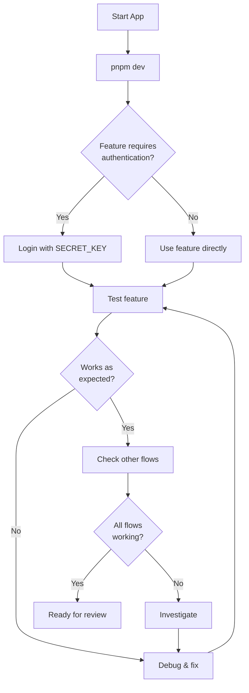

# Orchestrator: Multi-Step Feature Workflow

This guide walks you through a complete feature implementation workflow for the N8N PWA Chat App. Follow this template when Claude Code is tasked with adding features.

## Phase 0: Planning & Analysis (5–10 min)

### Read These Files First
1. **`claude.md`** (in repo root) — Project overview + key files
2. **`.claude/patterns-nextjs.md`** — Naming, imports, structure
3. **`.claude/architecture.md`** — Component tree, request flow, stores
4. **`.claude/design-tokens.md`** — Colors, spacing, responsive patterns

### Clarify the Task
- What is the **user-facing feature** (new button, form field, API endpoint)?
- Which **layers** are affected (client component, store, API route, N8N)?
- **Acceptance criteria**: How do we verify it works?
- **Scope**: Is it a full end-to-end feature or a partial addition?

### Example Task Breakdown
```
Feature: "Add conversation clear button that resets messages and session"

Layers affected:
  - UI: New "Clear Chat" button in ChatInterface header
  - Store: New clearMessages() action in chatStore (already exists, just use it)
  - API: No changes needed (clearing is local only)
  - N8N: sessionId in localStorage gets removed
  
Acceptance:
  - Button appears in header
  - Clicking shows confirmation dialog
  - Messages array clears
  - sessionId removed from localStorage
  - User can start fresh conversation
```

---

## Phase 1: Implement (20–60 min, depending on scope)

### Step 1A: Create/Update Components (if UI change)

**Pattern: Create one component per file**

```tsx
// src/components/chat/ClearChatButton.tsx
"use client";

import { useChatStore } from "@/store/chatStore";

export const ClearChatButton = () => {
  const clearMessages = useChatStore((state) => state.clearMessages);

  const handleClear = () => {
    if (confirm("Clear all messages? This cannot be undone.")) {
      clearMessages();
    }
  };

  return (
    <button
      onClick={handleClear}
      className="text-sm text-muted-foreground hover:text-foreground transition-colors min-h-[44px] px-3 touch-manipulation"
      aria-label="Clear chat"
    >
      Clear
    </button>
  );
};
```

**Checklist:**
- [ ] Component is `"use client"` if using hooks/Zustand
- [ ] Use `@/` imports only
- [ ] Use color tokens: `text-muted-foreground`, not `text-gray-500`
- [ ] Mobile: `min-h-[44px]` for tap targets
- [ ] Export as named export: `export const ComponentName = () => { }`
- [ ] One component per file, named after component

### Step 1B: Integrate Component into Parent

Find the parent component that should contain the new component:

```tsx
// src/components/chat/ChatInterface.tsx
// At the top:
import { ClearChatButton } from "./ClearChatButton";

// In the header section, add button to button group:
<div className="flex items-center gap-2 sm:gap-4 flex-shrink-0">
  <ThemeToggle variant="compact" />
  <ClearChatButton />  {/* NEW */}
  <button ... About>
  <button ... Logout>
</div>
```

### Step 1C: Add Store Actions (if state change)

Edit the relevant store (e.g., `src/store/chatStore.ts`):

```tsx
interface ChatStore extends ChatState {
  clearMessages: () => void;  // already exists!
}

export const useChatStore = create<ChatStore>((set) => ({
  // ... existing state ...
  
  clearMessages: () => {
    removeSessionId();  // imported from src/lib/storage
    set({ messages: [], error: null });
  },
}));
```

**Checklist for new store actions:**
- [ ] Add to store interface
- [ ] Use `set((state) => ({ ... }))` if depends on previous state
- [ ] Use `set({ ... })` for simple state changes
- [ ] Import utilities from `@/lib/storage` if needed
- [ ] Type all parameters strictly

### Step 1D: Add API Routes (if backend change)

Create new route files in `src/app/api/`:

```tsx
// src/app/api/newfeature/route.ts
import { NextRequest } from "next/server";

export async function POST(request: NextRequest) {
  try {
    const body = await request.json();

    // Validate
    if (!body.requiredField) {
      return new Response(
        JSON.stringify({ success: false, error: "Missing field" }),
        { status: 400, headers: { "Content-Type": "application/json" } }
      );
    }

    // Do work
    const result = await doSomething(body);

    // Return
    return new Response(
      JSON.stringify({ success: true, data: result }),
      { status: 200, headers: { "Content-Type": "application/json" } }
    );
  } catch (error) {
    return new Response(
      JSON.stringify({
        success: false,
        error: error instanceof Error ? error.message : "Error",
      }),
      { status: 500, headers: { "Content-Type": "application/json" } }
    );
  }
}
```

**Checklist:**
- [ ] Never hardcode `SECRET_KEY` or `N8N_WEBHOOK_URL` in response
- [ ] Always validate input
- [ ] Always return `Content-Type: application/json`
- [ ] Use `error instanceof Error` before `.message`
- [ ] Return proper HTTP status codes (400, 403, 500)

### Step 1E: Add API Client Methods (if new API route)

Update `src/lib/api.ts`:

```tsx
class ApiClient {
  async newFeature(params: SomeType): Promise<SomeResponse> {
    return this.request<SomeResponse>("/newfeature", {
      method: "POST",
      body: JSON.stringify(params),
    });
  }
}

export const apiClient = new ApiClient();

export const featureApi = {
  newFeature: (params: SomeType) => apiClient.newFeature(params),
};
```

**Checklist:**
- [ ] Type parameters and return value
- [ ] Add to `ApiClient` class
- [ ] Export via `featureApi` or similar
- [ ] Use `this.request()` generic method

### Step 1F: Add Types (if new data structures)

Update `src/types/index.ts`:

```tsx
export interface NewFeatureRequest {
  someField: string;
  optionalField?: number;
}

export interface NewFeatureResponse {
  success: boolean;
  data?: unknown;
  error?: string;
}
```

**Checklist:**
- [ ] All types in `src/types/index.ts`
- [ ] Use PascalCase for interface names
- [ ] Mark optional fields with `?`
- [ ] Export all types

---

## Phase 2: Verification (10–20 min)

### Checklist Before Running
- [ ] **Import paths**: All use `@/...`, no relative `../`
- [ ] **Component directives**: Client components have `"use client"`
- [ ] **TypeScript**: No `any` types, all errors in strict mode resolved
- [ ] **Colors**: No hardcoded `bg-blue-600`, using tokens like `bg-primary`
- [ ] **Mobile**: Min touch targets `44px`, inputs `text-base`
- [ ] **Error handling**: `try/catch`, `error instanceof Error`
- [ ] **Window guard**: `typeof window !== "undefined"` for localStorage/browser APIs
- [ ] **Store updates**: Using `set()` callback form when needed
- [ ] **Env vars**: Server-side only, or prefixed `NEXT_PUBLIC_` for client

### Lint & Type Check
```bash
cd /tmp/n8n-test
pnpm lint              # ESLint check
pnpm tsc --noEmit      # TypeScript type check (if available)
```

### Manual Testing Workflow



### Test Cases to Verify

1. **Happy path**: Feature works as intended
2. **Error handling**: Graceful failure (network down, invalid input)
3. **State consistency**: Store reflects UI, localStorage synced
4. **Mobile**: Tap targets hit-able, no zoom, responsive layout
5. **Theme**: Works in light & dark mode (check CSS variables)
6. **Accessibility**: Tab navigation, ARIA labels, color contrast

### Example: Testing "Clear Chat" Button

```
1. Load app, login
2. Send a few messages
3. Click "Clear Chat"
4. Confirm dialog
5. VERIFY:
   - Messages array is empty
   - ChatInterface shows empty state
   - sessionId removed from localStorage
   - Can start fresh conversation
   - Works in dark mode too
```

---

## Phase 3: Code Review Checklist

Before marking done, verify:

### File Organization
- [ ] Component in `src/components/{category}/ComponentName.tsx`
- [ ] Utility in `src/lib/utilName.ts`
- [ ] Store in `src/store/storeName.ts`
- [ ] API route in `src/app/api/{endpoint}/route.ts`
- [ ] Types in `src/types/index.ts`

### Code Quality
- [ ] No console.logs left behind (unless intentional for debugging)
- [ ] Comments for complex logic, not obvious code
- [ ] No unused imports
- [ ] Consistent code style (follows ESLint rules)

### TypeScript
- [ ] No `any` types
- [ ] All function return types explicit
- [ ] Union types for role: `"user" | "assistant"`, not strings
- [ ] Optional properties: `field?: Type`

### Performance
- [ ] No unnecessary re-renders (use Zustand selectors properly)
- [ ] No infinite loops or async cycles
- [ ] Memoization only where needed (don't over-optimize)

### Accessibility
- [ ] Form inputs have labels
- [ ] Buttons have `aria-label` if text not visible
- [ ] Focus states visible (Tailwind `focus:ring-2 focus:ring-ring`)
- [ ] Color not the only indicator of status

### Mobile/PWA
- [ ] Touch targets ≥ 44px: `min-h-[44px] min-w-[44px]`
- [ ] Inputs `text-base` to prevent iOS zoom
- [ ] Safe area respected: `safe-area-inset` class
- [ ] Works offline (if using service worker)

---

## Phase 4: Common Patterns & Gotchas

### Pattern: Integrating Zustand Store

```tsx
// ✓ Correct: Read only needed fields
const messages = useChatStore((state) => state.messages);
const isLoading = useChatStore((state) => state.isLoading);

// ✗ Avoid: Creating custom hook (not worth it for simple selectors)
const useMessages = () => useChatStore((s) => s.messages);

// ✓ Correct: Call action from store
const { sendMessage } = useChatStore();
await sendMessage(text, key);
```

### Pattern: Error Handling in Stores

```tsx
// ✓ Correct: Type check before accessing error.message
const error = err instanceof Error ? err.message : "Unknown error";
set({ error });

// ✗ Avoid: Assuming error is Error class
set({ error: err.message });  // fails if err is string
```

### Pattern: localStorage Access

```tsx
// ✓ Correct: Guard with typeof window
function getStoredKey() {
  if (typeof window !== "undefined") {
    return localStorage.getItem("secret-key");
  }
  return null;
}

// ✗ Avoid: Direct access in Server Component
const key = localStorage.getItem("secret-key");  // fails on server
```

### Pattern: Streaming SSE

```tsx
// ✓ Correct: API route streams, client consumes
// In route.ts:
controller.enqueue(encoder.encode(`data: ${JSON.stringify(chunk)}\n\n`));

// In client (api.ts):
const reader = response.body?.getReader();
while (true) {
  const { done, value } = await reader.read();
  if (done) break;
  // Process chunk
}

// ✗ Avoid: Returning large JSON all at once
return new Response(JSON.stringify(largeData));  // slow
```

### Pattern: State Updates Dependent on Previous State

```tsx
// ✓ Correct: Use set() callback
set((state) => ({
  messages: [...state.messages, newMessage],
  isLoading: false,
}));

// ✓ Also correct: Simple updates without dependency
set({ isLoading: true });
```

### Pattern: Color Tokens

```tsx
// ✓ Correct: Use design tokens
<button className="bg-primary text-primary-foreground hover:bg-primary-hover">

// ✗ Avoid: Hardcoded colors
<button className="bg-purple-600 text-white hover:bg-purple-700">
```

---

## Phase 5: Documentation & Handoff

When feature is complete:

1. **Update `.claude/architecture.md`** if new flows added
2. **Update relevant skill file** if pattern changed
3. **Add code comments** for non-obvious logic
4. **Document N8N webhook changes** if applicable
5. **Note any new env vars** required

### Template Comment Block
```tsx
/**
 * Clears conversation history and session ID.
 * Called when user clicks "Clear Chat" button.
 * Removes all messages from store and deletes sessionId from localStorage
 * to ensure next conversation starts fresh.
 */
clearMessages: () => {
  removeSessionId();
  set({ messages: [], error: null });
},
```

---

## Quick Reference: Common Tasks

### Add a New Component
1. Create file: `src/components/{category}/ComponentName.tsx`
2. Add `"use client"` if using hooks
3. Use `@/` imports
4. Use design tokens for colors
5. Export as named export
6. Integrate into parent

### Add a Store Action
1. Add method to store interface
2. Implement in `create()` callback
3. Use `set((state) => { ... })` if depends on prev state
4. Type all parameters

### Add an API Route
1. Create `src/app/api/{name}/route.ts`
2. Export `async function POST/GET(request: NextRequest)`
3. Validate input
4. Never expose `SECRET_KEY` or `N8N_WEBHOOK_URL`
5. Return proper status codes + `Content-Type: application/json`

### Add a Type
1. Add to `src/types/index.ts`
2. PascalCase name
3. Export
4. Use in components/stores/API

### Fix a Color
1. Check `src/app/globals.css` for CSS variable name
2. Map to Tailwind in `tailwind.config.js`
3. Use in component: `bg-background`, `text-foreground`, etc.
4. Never hardcode hex/rgb

---

## Debugging Tips

### TypeScript Errors
```bash
# Full type check
pnpm tsc --noEmit

# Check specific file
pnpm tsc src/components/MyCom.tsx --noEmit
```

### Runtime Errors
- **`window is not defined`**: Guard with `typeof window !== "undefined"` or move to client component
- **`Cannot read property of null`**: Type guard: `if (value) { ... }`
- **`undefined is not a function`**: Verify Zustand selector returns function
- **`Module not found`**: Check import path uses `@/...`

### Style Issues
- **Color wrong**: Check CSS variable in `globals.css` + Tailwind config
- **Not responsive**: Add `sm:`, `md:` prefixes for breakpoints
- **Missing on mobile**: Check `min-h-[44px]` for buttons, `text-base` for inputs

### SSE Not Streaming
- Check route handler returns `Content-Type: text/event-stream`
- Verify chunks formatted as `data: <json>\n\n`
- Check N8N webhook actually streams (might return JSON)

---

## Template: Feature Completion Checklist

```markdown
## Feature: [Name]

### Planning
- [ ] Analyzed existing codebase
- [ ] Understood affected layers
- [ ] Defined acceptance criteria

### Implementation
- [ ] Created/updated components
- [ ] Added store actions if needed
- [ ] Added API routes if needed
- [ ] Added types if needed
- [ ] Updated parent components

### Verification
- [ ] Ran `pnpm lint`
- [ ] No TypeScript errors
- [ ] Tested happy path
- [ ] Tested error case
- [ ] Works in light & dark mode
- [ ] Mobile-responsive
- [ ] Touch targets ≥ 44px

### Code Review
- [ ] Imports use `@/` paths
- [ ] Colors use design tokens
- [ ] No hardcoded environment vars
- [ ] Error handling with `instanceof Error`
- [ ] Window access guarded
- [ ] Comments for complex logic
- [ ] No console.logs

### Handoff
- [ ] Updated `.claude/` docs if needed
- [ ] Added code comments
- [ ] Verified with team
```

---

## Examples by Feature Type

### Example 1: Add a New Message Status (Read/Unread)

**Files to modify:**
1. `src/types/index.ts` — Add `isRead?: boolean` to `Message`
2. `src/store/chatStore.ts` — Add `markAsRead(messageId: string)` action
3. `src/components/chat/MessageBubble.tsx` — Show read indicator
4. `src/app/globals.css` — Add CSS for read indicator style (if custom)

### Example 2: Add Theme Selection Dropdown

**Files to modify:**
1. `src/components/theme/ThemeSelector.tsx` (new) — Dropdown component
2. `src/store/themeStore.ts` — Update to support `"light" | "dark" | "auto"`
3. `src/components/theme/ThemeProvider.tsx` — Read new theme state
4. `src/app/globals.css` — Potentially add new `:root` or `.auto` theme

### Example 3: Add Message Search

**Files to modify:**
1. `src/store/chatStore.ts` — Add `searchQuery` state, `setSearchQuery()`, `filteredMessages` selector
2. `src/components/chat/SearchBox.tsx` (new) — Input + button
3. `src/components/chat/ChatInterface.tsx` — Integrate SearchBox, render filtered messages
4. No API routes needed (client-side only)

### Example 4: Add Conversation Export (Download JSON)

**Files to modify:**
1. `src/store/chatStore.ts` — Add `exportMessages()` action
2. `src/components/chat/ExportButton.tsx` (new) — Trigger download
3. `src/app/api/export/route.ts` (optional) — Only if server-side processing needed
4. No new Zustand state needed (just action)

---

## When Stuck

1. **Re-read the relevant `.claude/` skill file** (patterns, architecture, or design tokens)
2. **Check existing code** for similar patterns (e.g., how `sendMessage` works in `chatStore.ts`)
3. **Search the repo** for the component/function name
4. **Trace the data flow** using the architecture diagrams
5. **Run TypeScript check** to catch type issues early
6. **Test incrementally** (don't wait until everything is done)

---

**Last Updated:** 2026
**N8N PWA Chat App v0.1**
