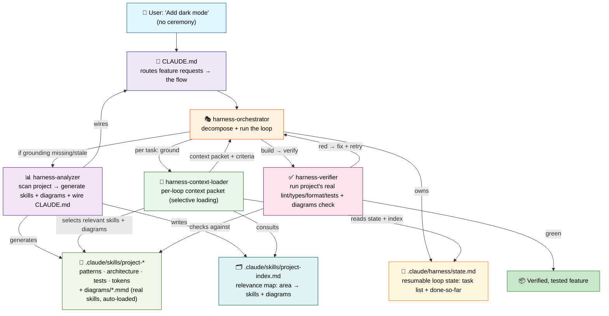

# Architecture

## Overview

Harness is **four Claude Code skills** that work together. Each is a `SKILL.md` of instructions Claude executes with its own tools (`Glob`, `Grep`, `Read`, `Write`, `Bash`, `Agent`). There is no external program, CLI, or runtime — **Claude is the harness**.

The skills form three roles:

1. **Ground** — `harness-analyzer` learns the project, **generates `project-*` grounding skills** (with standalone diagram files) under `.claude/skills/`, writes a relevance index, and wires `CLAUDE.md`.
2. **Focus** — `harness-context-loader` turns those generated skills + diagrams into a per-loop context packet, selecting only what the current task needs.
3. **Drive & check** — `harness-orchestrator` runs the build loop from resumable state; `harness-verifier` gates each step.



The key move: the analyzer's output is **real skills with frontmatter**, so Claude auto-loads them — and the `CLAUDE.md` it wires routes the *next* feature request through the loop without the user asking. The harness becomes self-governing.

---

## The skills

### 1. harness-analyzer

**Role:** learn the project, generate grounding skills + diagram files, write the relevance index, wire `CLAUDE.md`.

**Does:** detects the stack from real manifests; maps the architecture as standalone Mermaid diagram files; extracts naming/import/structure patterns from representative files; captures test conventions; captures design tokens for UI projects. Everything is evidence-based — anything it can't determine is written as "unknown", not invented.

**Generates real skills under `.claude/skills/`** (each a `SKILL.md` with `name` + `description` frontmatter, so Claude auto-loads them):
- `project-patterns-{lang}/SKILL.md`
- `project-architecture/SKILL.md`
- `project-test-patterns/SKILL.md`
- `project-design-tokens/SKILL.md` (UI only)

**Generates standalone diagram files** under each grounding skill's `diagrams/` folder, which the `project-*` skills **reference by path** instead of embedding inline Mermaid:
- `project-architecture/diagrams/components.mmd` — module/dependency graph
- `project-architecture/diagrams/data-flow.mmd` — the canonical request/data happy-path
- `project-patterns-{lang}/diagrams/layers.mmd` — allowed-dependency / layering rules
- `project-patterns-{lang}/diagrams/idiom-*.mmd` — zero or more recurring idioms

**Also generates `.claude/skills/project-index.md`** — a relevance index: a table mapping area → which `project-*` skills + diagrams to load for a task. This powers selective loading, so each loop pulls only what a task needs.

**Also wires `CLAUDE.md`** at the project root: summarizes the project, lists the generated `project-*` skills and what each governs, and instructs that non-trivial feature requests run through `harness-orchestrator`. If a `CLAUDE.md` exists, it merges rather than clobbering.

### 2. harness-context-loader

**Role:** focus the grounding for one task, every loop.

**Does:** ensures grounding exists (runs the analyzer first if not); reads `.claude/harness/state.md` (for the current task and what's done so far) and `.claude/skills/project-index.md` (to map the task's area → the relevant skills + diagrams); via **selective loading** it pulls only those skills and diagram files — not every generated skill — and emits a compact, ephemeral **context packet**: a short user-ask summary, done-so-far, the current task, the exact context to use (patterns, the relevant diagrams, design tokens if UI, test expectation), and a checklist of acceptance criteria. The packet is rebuilt each loop so context stays precise; it is what the build runs against and what the verifier checks the result against.

It stays a **separate skill** with a single clear responsibility — turning auto-loaded grounding into a *task-specific* context packet — rather than folding that into the orchestrator.

### 3. harness-orchestrator

**Role:** drive the build.

**Does:** decomposes the requirement into the smallest independently-verifiable tasks, ordered by dependency, tracked with a todo list (`TodoWrite`). It **initializes and maintains `.claude/harness/state.md`** — the resumable run state it owns: a short user-ask summary, the task list with status markers (`[ ]` pending, `[>]` in progress, `[x]` done), and a rolling "done so far" log. The state file survives compaction and restarts, so the orchestrator can resume the loop from it rather than starting over. For each task it runs the loop:

```
ground  → harness-context-loader builds the context packet + acceptance criteria
plan    → state the approach + files to touch
build   → implement, following project patterns
verify  → harness-verifier; fix on red, re-verify
test    → add + run tests until green
```

As tasks move through the loop it updates their markers in `state.md` and appends to the done-so-far log. A task is complete only when verify and test both pass. Independent tasks may run in parallel via dispatched subagents (`Agent`); dependent tasks run serially.

### 4. harness-verifier

**Role:** the quality gate.

**Does:** discovers the project's real commands (from `package.json` scripts, `pyproject.toml`, `Makefile`, CI config) — never assumed — runs lint / type-check / format-check / tests, and checks the changed files for naming/import/location conformance against the `project-patterns-*` skill. It additionally runs a **`diagrams` gate**: it checks the change respects the diagrams it was grounded on — the layering / allowed-dependency rules in `layers.mmd` and the canonical `data-flow.mmd`. Reports each gate as pass / fail / not-configured **with the real output**, then drives fixes until green. It never claims a gate passed without running it, and doesn't paper over failures by loosening configs or skipping tests.

---

## Data & flow

```
Project root
  │
  ├── harness-analyzer scans
  │     ├─► .claude/skills/project-{patterns, architecture, test-patterns, design-tokens}/SKILL.md
  │     │        (real skills — committable, auto-loaded by Claude)
  │     ├─► .claude/skills/project-*/diagrams/*.mmd
  │     │        (components, data-flow, layers, idiom-* — referenced by the skills)
  │     ├─► .claude/skills/project-index.md   (relevance map: area → skills + diagrams)
  │     └─► CLAUDE.md   (wired so feature requests follow the flow)
  │
  └── feature request → CLAUDE.md routes it → harness-orchestrator
        ├── decompose requirement → ordered task list
        ├── write/maintain .claude/harness/state.md  (resumable: tasks + done-so-far)
        └── for each task:
              ├── harness-context-loader reads state.md + project-index.md
              │     └── selects relevant project-* skills + diagrams → context packet + criteria
              ├── build the change against the packet
              ├── harness-verifier runs the project's real gates + pattern check + diagrams check
              │     └── on failure: read errors, fix, re-verify
              └── add + run tests until green
        └─► verified code + tests
```

Grounding still lives as skills plus their referenced diagram files under `.claude/skills/` — there is no separate grounding data folder. The only run-state file is the small, auto-managed `.claude/harness/state.md` the orchestrator owns for resumability.

---

## Design decisions

**Why skills instead of a CLI/program?**
In Claude Code, the skill *is* the executable unit. Claude already has the tools to scan, write, run commands, and dispatch agents — wrapping that in an external program would add a runtime to install and maintain for no benefit. Keeping everything as `SKILL.md` means zero install, and it works wherever Claude Code runs.

**Why generate skills + wire `CLAUDE.md` instead of a data folder?**
The earlier model wrote grounding to a data folder a loader had to be told to read. Generating real `SKILL.md` files instead means Claude **auto-loads** the grounding by description, and wiring `CLAUDE.md` means the *next* feature request routes through the loop on its own. The harness becomes self-governing — the user just asks for features, with no ceremony. The generated skills are normal committable files, so a team shares the same grounding.

**Why run the project's own commands?**
Assuming `eslint`/`pytest`/etc. is how style drift and false "passing" claims creep in. Reading the project's real scripts means the verifier checks what the project actually enforces — and reports "not configured" honestly when a gate is absent.

**Why standalone diagram files?**
Mermaid is text-based, diffable, and versionable, and renders in Markdown/GitHub — but keeping the diagrams as standalone `.mmd` files (rather than inline in a skill) lets the `project-*` skills **reference** them selectively per task and load them only when relevant, keeping the grounding accurate and reviewable without bloating every context with diagrams that don't apply.

**Why a relevance index + per-loop context packet?**
Selective loading keeps each loop's context precise: the `project-index.md` map lets the loader pull only the skills + diagrams a task actually needs, instead of dumping all grounding. The context packet then carries the user-ask summary, done-so-far, and current task into every loop, so long, multi-task builds don't lose the thread.

**Why file-backed loop state?**
A run can span many loops and outlive a single context window. Keeping the task list and done-so-far in `.claude/harness/state.md` means the loop survives compaction and restarts — the orchestrator resumes from the file instead of starting over or re-doing finished work.

**Why a verification loop?**
The model can hallucinate. Verifying immediately against real gates catches errors early, feeds concrete failures back into the next attempt, and keeps "done" honest — no "passing" claim without command output behind it.

---

## Distribution

- **Per project:** copy the `harness-*` skill folders into the project's `.claude/skills/`.
- **Everywhere:** package the skills as a Claude Code plugin so they auto-load in every repo (see [SETUP.md](SETUP.md#install-as-a-plugin)).

The generated `project-*` skills are committed alongside the project; the core `harness-*` skills come from the copy or plugin.

---

## Extending

**Add a domain skill.** Create a new skill folder (`skills/<domain>/SKILL.md` in this plugin, or a target project's `.claude/skills/<domain>/SKILL.md` for a one-off) using `templates/domain-skill.template`. Write it as direct instructions Claude follows — same Claude-native style as the four core skills — and reference the `project-*` grounding it should consult.

**Add a verifier gate.** Edit `harness-verifier/SKILL.md` to discover and run the additional command (e.g. a security or accessibility check), reporting it alongside the existing gates with real output.

**Add a generated grounding skill.** Edit `harness-analyzer/SKILL.md` to detect the new area and generate an extra `project-*` skill for it (plus any `diagrams/*.mmd` it should carry, and a row in `project-index.md`), and `harness-context-loader/SKILL.md` to pull it into the context packet when relevant.
