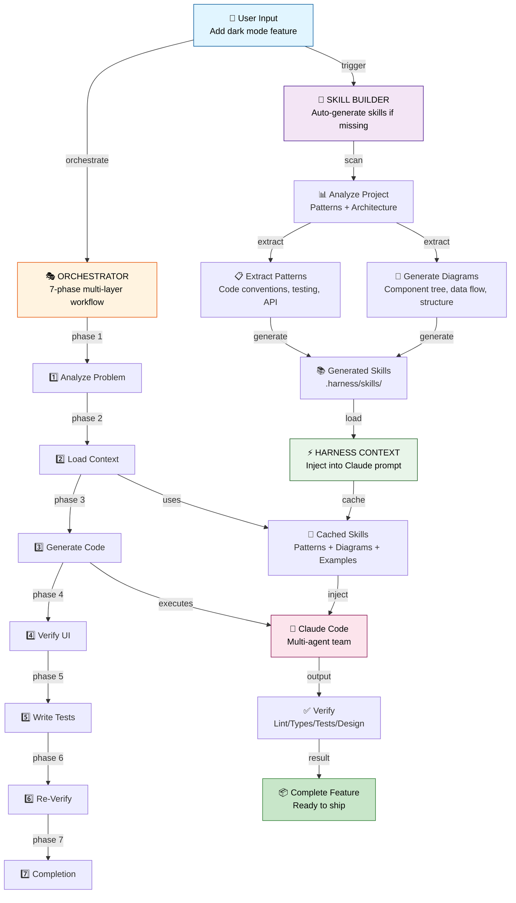
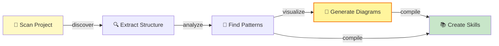

# Architecture

## Overview

**Harness** is a three-layer AI dev orchestration system:

1. **Skill Builder** — Auto-generate project-specific skills (with Mermaid diagrams)
2. **Harness Context** — Inject skills into Claude's understanding
3. **Orchestrator** — 7-phase multi-layer workflow coordinator



---

## Layer 1: Skill Builder

**Purpose:** Auto-detect and generate project-specific skills

**Process:**



**Output: Skill Files with Diagrams**

```markdown
# React Components Skill

## Architecture

\`\`\`mermaid
graph TB
    App["App.jsx"]
    Layout["Layout"]
    Header["Header"]
    Navigation["Navigation"]
    Main["Main"]
    Footer["Footer"]
    
    App --> Layout
    Layout --> Header
    Layout --> Main
    Layout --> Footer
    Header --> Navigation
    
    style App fill:#bbdefb
    style Layout fill:#c8e6c9
    style Header fill:#fff9c4
    style Navigation fill:#ffccbc
\`\`\`

## Data Flow

\`\`\`mermaid
graph LR
    State["React State"]
    Props["Props"]
    Component["Component"]
    JSX["Render"]
    
    State --> Component
    Props --> Component
    Component -->|render| JSX
\`\`\`

## Patterns
- Functional components with hooks
- Context API for global state
- ...
```

## Component Details

### 1. harness-codebase-analyzer

**Purpose**: Scan your project and extract patterns

**Inputs**:
- Project root directory
- Configuration (languages, depth, targets)

**Outputs**:
- `.harness/generated/harness-patterns-{lang}.md` — Code conventions
- `.harness/generated/harness-arch-{domain}.md` — Component structure
- `.harness/generated/harness-design-tokens.md` — UI tokens
- `.harness/generated/harness-test-patterns.md` — Testing approach
- `.harness/generated/diagrams/*.mermaid` — Architecture diagrams

**Technology**:
- Python AST parsing for language detection
- Dependency graph analysis
- Pattern extraction via regex + heuristics

---

### 2. harness-context-loader

**Purpose**: Transform generated patterns into AI-ready context

**Inputs**:
- Task/requirement description
- Generated patterns from analyzer
- Configuration (what context to include)

**Outputs**:
- Context injection prompt (markdown)
- Relevant examples & code snippets
- Mermaid diagrams

**Example Output**:
```
PROJECT: my-app (React + TypeScript)
TASK: Add user authentication modal

ARCHITECTURE:
[mermaid diagram]

CODE PATTERNS (React):
- Components: PascalCase (AuthModal.tsx)
- Hooks: useXxx pattern (useAuth.ts)
- Imports: Absolute paths (@/components)

DESIGN TOKENS:
- Primary color: #1976d2
- Spacing: 8px base unit

TEST PATTERN:
[Jest + React Testing Library example]

ACCEPTANCE CRITERIA:
✓ Component in src/components/AuthModal/
✓ Follows naming patterns
✓ Uses design tokens
✓ >80% test coverage
```

**Technology**:
- Template-based prompt building
- Context selection logic (auto-detect relevant patterns)
- Token counting (to fit within context windows)

---

### 3. harness-code-orchestrator

**Purpose**: Coordinate the full workflow

**Inputs**:
- User requirement ("Add user authentication")
- Project configuration
- Max retry/parallel limits

**Process**:

1. **DECOMPOSE**: Break requirement into tasks
   - Uses Claude to understand scope
   - Creates task list with dependencies

2. **FOR EACH TASK**:
   - **THINK**: Load context, plan approach
   - **CREATE**: Delegate to Claude Code with context injection
   - **VERIFY**: Run linter, type-check, style check
   - **TEST**: Write and run tests
   - **COMMIT**: Write files to disk

3. **COORDINATE**:
   - Serial: Execute tasks in dependency order
   - Parallel: Run independent tasks concurrently (respecting limit)
   - Error handling: Retry or explain errors to Claude

**Outputs**:
- Generated code files
- Generated test files
- `.harness/journal.md` — Execution log
- `.harness/state.json` — Task state (for recovery)

**Technology**:
- Task graph analysis (dependency ordering)
- Process orchestration (serial/parallel scheduling)
- State machine for task phases (think → create → verify → test → commit)

---

### 4. harness-verifier

**Purpose**: Ensure generated code meets quality standards

**Inputs**:
- Generated code files
- Verification configuration (checks to run)

**Checks**:
- **Lint**: ESLint, Pylint, etc. (catches code errors)
- **Type-check**: TypeScript, mypy (catches type errors)
- **Style**: Prettier, Black (enforces formatting)
- **Test**: Jest, pytest (runs tests)
- **Coverage**: Checks coverage % meets threshold
- **Patterns**: Validates against learned patterns

**Outputs**:
- Verification report (pass/fail per check)
- Error messages (if any)
- Coverage metrics

**On Failure**:
- Returns errors to orchestrator
- Orchestrator explains to Claude + regenerates
- Retry loop until passing or max_retries

**Technology**:
- Tool invokers (ESLint API, TypeScript compiler, etc.)
- Coverage analysis
- Pattern matching (regex, AST analysis)

---

### 5. harness-readme-generator

**Purpose**: Auto-document the project with harness context

**Inputs**:
- Generated patterns & architecture
- Project metadata
- Generator configuration

**Outputs**:
- Auto-generated README section
- Links to `.harness/generated/` context files
- How-to for using harness
- Architecture overview

**Technology**:
- Markdown templating
- File generation

---

## Data Flow

```
Project Root
  ├── analyzer scans
  │   └─► .harness/generated/
  │       ├── harness-patterns-*.md
  │       ├── harness-arch-*.md
  │       ├── harness-design-tokens.md
  │       ├── harness-test-patterns.md
  │       └── diagrams/
  │
  ├── context-loader reads generated
  │   └─► context injection prompts
  │
  ├── orchestrator decomposes requirement
  │   └─► task list
  │
  ├── for each task:
  │   ├── context-loader builds prompt
  │   ├── Claude Code generates
  │   ├── verifier checks
  │   ├── (if fails: regenerate)
  │   └── commit to disk
  │
  └─► final code + tests + journal
```

---

## Error Handling & Recovery

### Verification Failures

```python
if verification_fails:
    # Collect errors
    errors = verifier.get_errors()
    
    # Explain to Claude
    context = f"""
Previous code failed verification:
{errors.summary()}

Issues:
{errors.explanation()}

Please fix and regenerate.
"""
    
    # Regenerate with error context
    new_code = claude_code.generate(
        task=task,
        context=context,
        previous_attempt=code
    )
    
    # Retry verification
    if verifies(new_code):
        commit(new_code)
    else if retries < max_retries:
        retry()
    else:
        fail_with_explanation()
```

### Dependency Management

```python
# Build task dependency graph
graph = build_dependency_graph(tasks)

# Topological sort for serial execution
if not parallel:
    tasks = topological_sort(graph)
    execute_serial(tasks)
else:
    # Execute independent tasks in parallel
    for batch in parallel_batches(graph, parallel_limit):
        execute_parallel(batch)
```

---

## Configuration Precedence

1. **CLI args** (highest priority)
   ```bash
   harness orchestrate --parallel-limit 4 --max-retries 5
   ```

2. **Project config** `.harness/config.yaml`
   ```yaml
   orchestrator:
     parallel_limit: 2
     max_retries: 3
   ```

3. **Global config** `~/.harness/config.yaml`
   ```yaml
   orchestrator:
     parallel_limit: 1
   ```

4. **Defaults** (lowest priority)

---

## Design Decisions

### Why Multiple Skills?

Each skill has a single responsibility:
- **analyzer**: Extract patterns
- **context-loader**: Format context
- **orchestrator**: Coordinate workflow
- **verifier**: Validate output
- **readme-generator**: Document

Easier to test, extend, and maintain.

### Why Verification Loop?

Claude can hallucinate. By verifying immediately:
- Errors caught early
- Claude learns from feedback
- No need for manual code review (mostly)
- Confidence in shipped code

### Why Mermaid Diagrams?

Mermaid is:
- Text-based (easy to version control)
- Renderable in markdown (works in GitHub, etc.)
- Readable by humans and LLMs
- Light-weight (no binary images)

### Why Hermes Skills?

Hermes provides:
- Persistent context storage (memory)
- Skill registry & discovery
- Integration with other tools
- Easy distribution to teammates

---

## Extensibility

### Adding a New Verifier Check

```python
# harness-verifier/config/rules.yaml
verifier:
  checks:
    - my_custom_check:
        enabled: true
        config: .my-check-config.yaml

# harness-verifier/scripts/my_custom_check.py
class MyCustomCheck(BaseCheck):
    def run(self, code_path):
        # Return CheckResult(passed=bool, errors=list)
        pass
```

### Adding a New Context Source

```python
# harness-context-loader/scripts/loaders/my_loader.py
class MyContextLoader(BaseLoader):
    def load(self):
        # Return context string
        pass

# harness-context-loader/SKILL.md
context_sources:
  - patterns
  - architecture
  - my_custom_source  # Added!
```

---

## Performance Considerations

### Analyzer Performance
- **Problem**: Scanning large repos is slow
- **Solution**: Exclude common folders (node_modules, dist, .git)
- **Caching**: Store analysis results, invalidate on file changes

### Context Size
- **Problem**: Large context bloats Claude's context window
- **Solution**: Limit `max_tokens`, auto-select relevant patterns
- **Truncation**: Summarize if necessary

### Parallel Limits
- **Problem**: Too many parallel tasks → resource contention
- **Solution**: Configurable `parallel_limit` (default: 2)
- **Batching**: Execute in dependency-ordered batches

---

## Future Enhancements

- [ ] **Caching**: Cache analyzer results, invalidate on changes
- [ ] **Incremental analysis**: Only re-scan changed files
- [ ] **Web UI**: Dashboard for monitoring orchestrator runs
- [ ] **Multi-project**: Orchestrate across repos
- [ ] **Custom verifiers**: User-defined checks
- [ ] **Learning**: Improve pattern extraction over time
- [ ] **Integration**: GitHub Actions, GitLab CI, etc.
