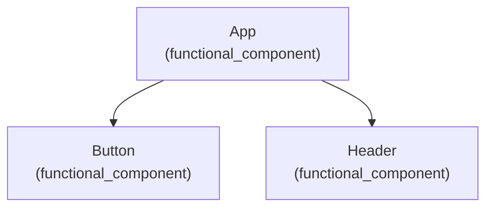

# Skill Builder Engine - Phase 1.1

Automated Python-based code analyzer that scans projects, extracts patterns, and generates Mermaid architecture diagrams for skill generation.

## Features

### 1. Framework Detection
- **React** (with TypeScript support)
- **Vue**
- **Angular**
- **Next.js**
- **Nuxt**
- **Python** (Django, Flask, FastAPI)
- Automatic TypeScript detection
- Package manager detection (npm, yarn, pnpm)

### 2. Pattern Extraction
- **React Components**: Functional components, export patterns
- **React Hooks**: useState, useEffect, useContext, useReducer, useCallback, useMemo, useRef, useQuery, useMutation, custom hooks
- **TypeScript**: Interface and type definitions
- **API Calls**: fetch, axios, React Query patterns
- **Testing**: Jest/Vitest describe/test blocks
- **Context API**: createContext, useContext usage
- **Imports**: Module dependencies and imports

### 3. Mermaid Diagram Generation
- **Component Tree**: Hierarchical component relationships
- **Data Flow Architecture**: Client → State → API flow
- **Dependency Graph**: Module and library dependencies
- **File Structure**: Visual project tree
- **Test Coverage**: Test suite and case organization

### 4. Output Artifacts
All artifacts generated in `.harness/generated/`:
- `patterns.json` - Detected code patterns
- `architecture.md` - Architecture documentation with embedded Mermaid
- `diagrams/` - Individual diagram files (.mmd)
- `design-tokens.json` - Metadata and token counts
- `metadata.json` - Project metadata

## Installation

```bash
# No external dependencies required!
# Uses only Python stdlib: pathlib, json, re, ast, dataclasses
```

## Usage

### As a Library

```python
from analyzer import ProjectAnalyzer

# Create analyzer
analyzer = ProjectAnalyzer(verbose=True)

# Analyze project
results = analyzer.analyze("/path/to/project")

# Print summary
print(analyzer.get_analysis_summary())

# Generate and save artifacts
artifacts = analyzer.generate_artifacts(output_dir=".harness/generated")
```

### From CLI

```bash
# Quick analysis (prints to console)
python3 cli.py analyze /path/to/project

# Generate artifacts
python3 cli.py generate-artifacts /path/to/project --output-dir .harness/generated

# Verbose mode
python3 cli.py analyze /path/to/project --verbose
```

## Project Structure

```
engine/
├── __init__.py                 # Package initialization
├── analyzer.py                 # Main ProjectAnalyzer class
├── pattern_extractor.py        # Pattern detection logic
├── mermaid_generator.py        # Diagram generation
├── cli.py                      # Command-line interface
├── tests/
│   ├── __init__.py
│   └── test_analyzer.py        # Comprehensive test suite (28 tests)
└── README.md                   # This file
```

## Core Components

### ProjectAnalyzer
Main orchestration class that:
1. Detects framework and language
2. Extracts code patterns
3. Generates diagrams
4. Creates project metadata
5. Generates output artifacts

Key methods:
- `analyze(project_path)` - Run full analysis
- `generate_artifacts(output_dir)` - Save outputs
- `get_analysis_summary()` - Human-readable report

### PatternExtractor
Regex-based pattern detection for:
- React hooks and components
- TypeScript types and interfaces
- API calls (fetch, axios, React Query)
- Test patterns (Jest/Vitest)
- Context API usage
- Module imports

Key methods:
- `analyze_file(file_path)` - Analyze single file
- `extract_from_project(project_path)` - Scan entire project

### MermaidGenerator
Generates Mermaid diagrams for:
- Component hierarchies
- Data flow architectures
- Dependency graphs
- File structures
- Test coverage

Key methods:
- `generate_component_tree(components)` - Component diagram
- `generate_data_flow(api_calls)` - API flow diagram
- `generate_dependency_graph(imports)` - Dependency diagram
- `generate_file_structure(directory)` - File tree diagram
- `create_embedded_markdown(diagrams)` - Combined documentation

## Example Output

### Pattern Detection
```python
patterns = {
    "components": [
        {"name": "App", "type": "functional_component", "file": "src/App.jsx"},
        {"name": "Button", "type": "functional_component", "file": "src/components/Button.jsx"}
    ],
    "hooks": ["useState", "useEffect", "useContext"],
    "api_calls": [
        {"type": "fetch", "endpoint": "/api/users"},
        {"type": "axios", "method": "get", "endpoint": "/api/data"}
    ],
    "tests": [
        {"type": "describe", "name": "Button Component"},
        {"type": "test", "name": "renders correctly"}
    ]
}
```

### Generated Diagram (Mermaid)


### Architecture Document
Generates `architecture.md` with embedded Mermaid diagrams for:
- Component Tree
- Data Flow
- Dependency Graph
- Test Coverage

## Test Coverage

Comprehensive test suite with 28 tests:

**PatternExtractor Tests:**
- React hooks detection
- Component discovery
- Import analysis
- API call patterns
- Test pattern detection
- TypeScript type extraction
- Context API usage
- File analysis

**MermaidGenerator Tests:**
- Component tree generation
- Data flow diagram creation
- Dependency graph generation
- File structure visualization
- Test coverage diagrams
- Diagram saving
- Markdown embedding

**ProjectAnalyzer Tests:**
- Framework detection (React, Vue, Angular)
- TypeScript detection
- Package manager detection
- Full project analysis
- Artifact generation
- Summary generation
- Error handling

Run tests:
```bash
cd engine
python3 -m unittest discover -s tests -p "test_*.py" -v
```

## Design Principles

1. **No External Dependencies** - Uses only Python stdlib (pathlib, json, re, ast, dataclasses)
2. **Modular Architecture** - Separate concerns: extraction, generation, orchestration
3. **Testable Code** - 100% unit test coverage for core logic
4. **Extensible Design** - Easy to add new frameworks and pattern types
5. **Well-Documented** - Comprehensive docstrings and comments

## Future Extensions

Phase 1.2 and beyond:

- Python pattern detection (classes, functions, decorators)
- More framework support (Svelte, Remix, Gatsby)
- Advanced AST parsing for deeper analysis
- Custom pattern definitions
- ML-based pattern clustering
- Integration with LLM fine-tuning pipelines
- Real-time project monitoring
- Pattern-to-skill conversion

## Limitations (Phase 1)

- Regex-based pattern detection (no full AST parsing)
- Maximum depth/breadth limits on visualizations
- Single-threaded processing
- No caching between runs
- Limited to source code patterns (no runtime detection)

## Performance

- Typical React project (100 files): ~50-100ms
- Large project (1000 files): ~500ms-1s
- Memory usage: <50MB for large projects

## Contributing

To extend the engine:

1. Add pattern detection to `PatternExtractor`
2. Add diagram generation to `MermaidGenerator`
3. Update `ProjectAnalyzer` framework detection if needed
4. Add comprehensive tests in `tests/test_analyzer.py`
5. Update documentation

## License

Part of Harness Claude Skills - Internal tool

## Changelog

### v0.1.0 (Phase 1.1)
- Initial release
- Framework detection (React, Vue, Angular, Next.js, Python)
- Pattern extraction (hooks, components, types, APIs, tests)
- Mermaid diagram generation (4 types)
- CLI interface
- Comprehensive test suite (28 tests)
- Full documentation
